# PageSpy 远程调试框架落地调研

## 🎯 概述

PageSpy 是货拉拉开源的远程调试框架，支持实时查看页面日志、网络请求、元素信息等。本文档通过分层架构的视角，结合丰富的图表和流程图，深入调研其在企业级项目中的落地方案。

### 📊 核心价值

```mermaid
mindmap
  root((PageSpy 核心价值))
    远程调试
      实时日志查看
      网络请求监控
      元素信息检查
      性能数据分析
    生产环境支持
      安全权限控制
      用户维度隔离
      动态开关管理
      数据脱敏保护
    企业级特性
      多项目管理
      环境隔离
      集群部署
      监控告警
```

### 🏗️ 整体架构概览


> 上图展示了 PageSpy 从用户端到服务端的完整交互流程，包括后台配置管理、用户端 SDK 集成、服务端 API 服务等核心组件的协作关系。

## 1. 🎛️ 开关控制策略

### 📋 策略概览

```mermaid
flowchart TD
    A[用户访问应用] --> B{检查项目配置}
    B -->|项目已启用| C{检查用户规则}
    B -->|项目未启用| D[不启用调试]
    C -->|规则匹配| E[启用PageSpy调试]
    C -->|规则不匹配| D
    E --> F[定时检查配置变更]
    F -->|配置变更| G{重新评估规则}
    G -->|仍然匹配| E
    G -->|不再匹配| H[关闭调试]
    
    style E fill:#e1f5fe
    style H fill:#ffebee
    style D fill:#f3e5f5
```

### 1.1 用户维度控制

#### 🔧 配置规则设计
```typescript
interface ProjectDebugConfig {
  projectId: string
  enabled: boolean
  rules: {
    [key: string]: string[]  // 支持任意自定义规则字段
  }
}

// 常用规则示例（用户可自定义）
interface CommonDebugRules {
  phones?: string[]     // 手机号白名单
  userIds?: string[]    // 用户ID白名单
  productIds?: string[] // 商品ID白名单
  ips?: string[]        // IP地址白名单
  roles?: string[]      // 用户角色白名单
  departments?: string[] // 部门白名单
  versions?: string[]   // 应用版本白名单
  // 用户可以继续添加任意规则字段
}
```

#### 🚀 实现方案

```mermaid
flowchart LR
    subgraph "规则匹配策略"
        A[用户上下文] --> B[精确匹配]
        B --> C{任一条件命中?}
        C -->|是| D[启用调试]
        C -->|否| E[不启用调试]
    end
    
    subgraph "缓存与降级"
        F[规则服务] --> G[本地缓存]
        G --> H{服务异常?}
        H -->|是| I[降级策略]
        H -->|否| J[正常流程]
    end
    
    style D fill:#c8e6c9
    style E fill:#ffcdd2
    style I fill:#fff3e0
```

**核心特性：**
1. **精确匹配**：采用简单的精确匹配策略，任一条件命中即启用
2. **项目隔离**：基于项目ID获取对应的规则配置
3. **缓存策略**：本地缓存规则，减少接口调用
4. **降级机制**：规则服务异常时的默认策略

#### 用户上下文类型定义
```typescript
// 支持自定义属性的用户上下文
interface UserContext {
  [key: string]: any  // 允许任意自定义属性
}

// 常用的预定义属性（可选）
interface CommonUserContext extends UserContext {
  phone?: string
  userId?: string
  productId?: string
  ip?: string
  // 用户可以继续添加任意属性
}
```

#### 核心逻辑
```typescript
class DebugController {
  async shouldEnableDebug(projectId: string, context: UserContext): Promise<boolean> {
    const config = await this.getProjectConfig(projectId)
    if (!config?.enabled) return false
    
    const { rules } = config
    
    // 遍历所有规则，检查是否有匹配的条件
    for (const [ruleKey, ruleValues] of Object.entries(rules)) {
      if (Array.isArray(ruleValues) && ruleValues.length > 0) {
        const contextValue = context[ruleKey]
        if (contextValue && ruleValues.includes(contextValue)) {
          return true  // 任一条件匹配即启用调试
        }
      }
    }
    
    return false
  }
  
  private async getProjectConfig(projectId: string): Promise<ProjectDebugConfig | null> {
    // 从缓存或接口获取项目配置
    return await this.configService.getProjectDebugConfig(projectId)
  }
}
```

### 1.2 ⏰ 触发时机

```mermaid
sequenceDiagram
    participant U as 用户
    participant A as 应用
    participant S as SDK管理器
    participant R as 规则服务
    
    Note over U,R: 页面加载时触发
    U->>A: 访问应用
    A->>S: 初始化SDK
    S->>R: 获取用户规则
    R-->>S: 返回规则配置
    S->>S: 评估是否启用
    
    Note over U,R: 动态切换（每20秒检查）
    loop 定时检查
        S->>R: 检查配置变更
        R-->>S: 返回最新配置
        alt 规则变更
            S->>S: 重新评估
            S->>A: 开启/关闭调试
        end
    end
    
    Note over U,R: 会话保持
    S->>S: 维持调试状态
    U->>A: 页面跳转
    S->>S: 保持连接状态
```

**关键特性：**
- **页面加载时**：根据用户信息判断是否启用
- **动态切换**：支持运行时开启/关闭调试（20秒轮询）
- **会话保持**：调试状态在会话期间保持

## 2. 🔌 项目接入方案

### 📦 SDK 架构设计

```mermaid
flowchart TB
    subgraph "业务应用层"
        A[移动端App]
        B[Web应用]
        C[小程序]
    end
    
    subgraph "PageSpy SDK 封装层"
        D[PageSpyManager]
        E[DebugController]
        F[ConfigService]
    end
    
    subgraph "PageSpy 核心层"
        G[数据收集]
        H[WebSocket通信]
        I[调试界面]
    end
    
    subgraph "服务端层"
        J[配置管理服务]
        K[规则引擎服务]
        L[PageSpy API服务]
    end
    
    A --> D
    B --> D
    C --> D
    D --> E
    D --> F
    E --> G
    F --> J
    G --> H
    H --> L
    
    style D fill:#e3f2fd
    style E fill:#f3e5f5
    style F fill:#e8f5e8
```

### 2.1 SDK 封装

#### 🏗️ 统一接入层
```typescript
// PageSpy 官方 InitConfig 接口
interface InitConfig {
  api?: string;           // PageSpy 服务端地址
  clientOrigin?: string;  // 调试端地址
  project?: string;       // 项目标识，用于在调试端房间列表中搜索
  title?: string;         // 项目标题
  autoRender?: boolean;   // 是否自动渲染控制按钮
  enableSSL?: boolean | null;    // 是否启用 SSL
}

class PageSpyManager {
  private instance: PageSpy | null = null
  private projectConfig: ProjectConfig | null = null
  private userContext: UserContext | null = null
  private configCheckTimer: NodeJS.Timeout | null = null
  private isEnabled: boolean = false
  private debugController: DebugController
  
  constructor() {
    this.debugController = new DebugController()
  }
  
  async init(projectConfig: ProjectConfig, userContext: UserContext) {
    this.projectConfig = projectConfig
    this.userContext = userContext
    
    // 初始检查
    await this.checkAndUpdateDebugStatus()
    
    // 启动定时检查（每20秒）
    this.startConfigPolling()
  }
  
  private async checkAndUpdateDebugStatus(): Promise<void> {
    if (!this.projectConfig || !this.userContext) return
    
    const shouldEnable = await this.checkDebugRules(
      this.projectConfig.id, 
      this.userContext
    )
    
    if (shouldEnable && !this.isEnabled) {
      // 需要开启但当前未开启
      this.enablePageSpy()
    } else if (!shouldEnable && this.isEnabled) {
      // 需要关闭但当前已开启
      this.disablePageSpy()
    }
  }
  
  private enablePageSpy(): void {
    if (!this.projectConfig || this.instance) return
    
    // SDK内部根据environment自动选择配置
    const apiUrl = this.projectConfig.environment === 'production' 
      ? 'https://pagespy.company.com'
      : 'https://pagespy-dev.company.com'
    
    // 使用 PageSpy 官方 InitConfig 接口
    this.instance = new PageSpy({
      api: apiUrl,
      project: this.projectConfig.name,  // project 参数确实存在
      title: this.projectConfig.title,
      autoRender: true,
      enableSSL: null  // 让 SDK 自动判断
    })
    this.isEnabled = true
    console.log(`[PageSpy] 调试已开启，用户: ${this.userContext?.userId || this.userContext?.phone || 'anonymous'}`)
  }
  
  private disablePageSpy(): void {
    if (this.instance) {
      // 注意：PageSpy 官方 API 中没有 abort() 或 destroy() 方法
      // 只能通过重新加载页面或设置为 null 来禁用
      this.instance = null
    }
    this.isEnabled = false
    console.log('[PageSpy] 调试已关闭')
  }
  
  private startConfigPolling(): void {
    // 清除已存在的定时器
    if (this.configCheckTimer) {
      clearInterval(this.configCheckTimer)
    }
    
    // 每20秒检查一次配置
    this.configCheckTimer = setInterval(async () => {
      try {
        await this.checkAndUpdateDebugStatus()
      } catch (error) {
        console.error('[PageSpy] 配置检查失败:', error)
      }
    }, 20000)
  }
  
  private async checkDebugRules(projectId: string, context: UserContext): Promise<boolean> {
    // SDK内部根据environment和allowedRoles自动判断权限
    if (this.projectConfig?.environment === 'production') {
      const allowedRoles = this.projectConfig.allowedRoles || []
      const userRole = context.role
      if (!allowedRoles.includes(userRole)) {
        return false
      }
    }
    return await this.debugController.shouldEnableDebug(projectId, context)
  }
  
  // 手动停止配置检查
  destroy(): void {
    if (this.configCheckTimer) {
      clearInterval(this.configCheckTimer)
      this.configCheckTimer = null
    }
    this.disablePageSpy()
  }
}
```

#### 项目配置管理
```typescript
// 简化的项目配置接口
interface ProjectConfig {
  id: string
  name: string
  title: string
  environment: 'development' | 'production'  // SDK根据此参数自动配置
  allowedRoles?: string[]  // 生产环境权限控制
}

// 用户上下文接口 - 支持自定义属性
interface UserContext {
  [key: string]: any  // 支持任意自定义属性
  // 常用属性示例
  userId?: string
  phone?: string
  productId?: string
  ip?: string
  role?: string
  department?: string
  version?: string
}

// 调试规则配置接口 - 支持自定义规则
interface ProjectDebugConfig {
  projectId: string
  enabled: boolean
  rules: {
    [key: string]: string[]  // 支持任意自定义规则
    // 常用规则示例
    phones?: string[]
    userIds?: string[]
    productIds?: string[]
    ips?: string[]
    roles?: string[]
    departments?: string[]
    versions?: string[]
    environments?: string[]
  }
}
```

### 2.2 🏢 多项目架构

#### 🎯 配置中心化

```mermaid
flowchart TD
    subgraph "管理后台"
        A[项目注册]
        B[规则配置]
        C[权限分配]
        D[监控告警]
    end
    
    subgraph "配置中心"
        E[项目配置存储]
        F[规则引擎]
        G[权限验证]
    end
    
    subgraph "多环境支持"
        H[开发环境]
        I[测试环境]
        J[生产环境]
    end
    
    A --> E
    B --> F
    C --> G
    E --> H
    E --> I
    E --> J
    
    style A fill:#e1f5fe
    style B fill:#f3e5f5
    style C fill:#e8f5e8
    style D fill:#fff3e0
```

**核心特性：**
- **项目注册**：统一的项目配置管理
- **环境隔离**：开发/测试/生产环境独立配置
- **权限控制**：基于项目的访问权限管理

#### 🏗️ 服务端架构

```mermaid
flowchart LR
    subgraph "配置管理服务"
        A1[项目配置]
        A2[环境管理]
        A3[权限控制]
    end
    
    subgraph "规则引擎服务"
        B1[用户规则]
        B2[条件匹配]
        B3[实时下发]
    end
    
    subgraph "PageSpy 服务"
        C1[调试会话]
        C2[数据收集]
        C3[远程调试]
    end
    
    A1 --> B1
    A2 --> B2
    A3 --> B3
    B1 --> C1
    B2 --> C2
    B3 --> C3
    
    style A1 fill:#e3f2fd
    style B1 fill:#f3e5f5
    style C1 fill:#e8f5e8
```

### 2.3 🚀 接入流程

#### 📋 接入步骤概览

```mermaid
flowchart TD
    A[开始接入] --> B[安装SDK]
    B --> C[项目注册]
    C --> D[环境配置]
    D --> E[规则设置]
    E --> F[权限分配]
    F --> G[测试验证]
    G --> H[生产部署]
    
    subgraph "配置详情"
        D1[开发环境配置]
        D2[生产环境配置]
        D3[自动环境识别]
    end
    
    subgraph "规则详情"
        E1[用户白名单]
        E2[IP限制]
        E3[角色权限]
    end
    
    D --> D1
    D --> D2
    D --> D3
    E --> E1
    E --> E2
    E --> E3
    
    style A fill:#e8f5e8
    style H fill:#e1f5fe
    style G fill:#fff3e0
```

#### ⚙️ 环境配置策略
用户只需在初始化时指定环境类型，SDK会自动选择合适的配置：

```typescript
// 简化的环境配置 - 用户只需指定环境
const debugManager = new PageSpyManager()
await debugManager.init({
  id: 'mobile-app-001',
  name: 'mobile-app',
  title: '移动端应用',
  environment: 'development'  // 或 'production'
}, userContext)

// SDK内部会根据environment自动选择：
// development: 启用所有功能，使用开发环境API
// production: 限制功能，使用生产环境API，默认关闭
```

#### 客户端接入
1. **安装 SDK**：`npm install @company/pagespy-sdk`
2. **项目初始化**：
```typescript
import { PageSpyManager } from '@company/pagespy-sdk'

const debugManager = new PageSpyManager()
await debugManager.init({
  id: 'mobile-app-001',
  name: 'mobile-app',
  title: '移动端应用',
  environment: process.env.NODE_ENV || 'development'  // SDK自动处理配置
}, {
  userId: getCurrentUserId(),
  phone: getCurrentUserPhone()
})
```

#### 使用示例
```typescript
// 项目初始化
const pageSpyManager = new PageSpyManager()

// 应用启动时 - 支持自定义属性
const userContext = {
  phone: '13800138000',
  userId: 'user123',
  productId: 'product456',
  ip: '192.168.1.100',
  // 自定义属性
  role: 'admin',
  department: 'frontend',
  version: '1.2.3',
  environment: 'production',
  customField: 'customValue'
}

// 初始化PageSpy - 简化配置
await pageSpyManager.init({
  id: 'mobile-app-001',
  name: 'mobile-app',
  title: '移动端应用',
  environment: process.env.NODE_ENV || 'development'
}, userContext)

// 应用退出时清理资源
window.addEventListener('beforeunload', () => {
  pageSpyManager.destroy()
})

// 动态配置变更示例
// 当用户登录状态改变时，重新初始化
function onUserLogin(newUserContext) {
  pageSpyManager.destroy() // 先清理旧的实例
  pageSpyManager.init({
    id: 'mobile-app-001',
    name: 'mobile-app',
    title: '移动端应用',
    environment: process.env.NODE_ENV || 'development'
  }, newUserContext) // 重新初始化
}

// 日志隔离的实际应用
// 方案1：按部门创建不同的project
function initPageSpyByDepartment(userContext) {
  const projectId = `mobile-app-${userContext.department}`
  pageSpyManager.init(projectId, userContext)
}

// 方案2：在关键日志中添加用户标识
function logWithUserInfo(message, data) {
  const userTag = `[${userContext.userId}|${userContext.name}]`
  console.log(`${userTag} ${message}`, data)
}

// 配置示例（后台管理）- 支持自定义规则
const projectConfig: ProjectDebugConfig = {
  projectId: 'mobile-app-001',
  enabled: true,
  rules: {
    // 常用规则
    phones: ['13800138000', '13900139000'],
    userIds: ['admin', 'tester'],
    productIds: ['test-product'],
    ips: ['192.168.1.100'],
    // 自定义规则
    roles: ['admin', 'developer', 'qa'],
    departments: ['frontend', 'backend', 'mobile'],
    versions: ['1.2.3', '1.2.4-beta'],
    environments: ['development', 'staging'],
    customField: ['customValue', 'anotherValue']
  }
}

// 动态配置变更场景：
// 1. 管理员在后台移除用户手机号 -> 20秒内自动关闭调试
// 2. 管理员在后台添加用户手机号 -> 20秒内自动开启调试
// 3. 项目整体禁用调试 -> 20秒内自动关闭调试
```

#### 管理后台配置
1. **项目注册**：在管理后台注册新项目
2. **规则配置**：设置调试规则和触发条件
3. **权限分配**：分配项目访问权限

## 3. ⚙️ 技术实现要点

### 3.1 👥 用户标识与日志隔离

#### 🎯 隔离策略概览

```mermaid
flowchart TB
    subgraph "用户维度隔离"
        A1[用户A日志]
        A2[用户B日志]
        A3[用户C日志]
    end
    
    subgraph "会话维度隔离"
        B1[会话1数据]
        B2[会话2数据]
        B3[会话3数据]
    end
    
    subgraph "项目维度隔离"
        C1[项目Alpha]
        C2[项目Beta]
        C3[项目Gamma]
    end
    
    subgraph "实现方案"
        D1[方案1: Project参数区分]
        D2[方案2: 日志标识注入]
        D3[方案3: 服务端定制]
    end
    
    A1 --> D1
    B1 --> D2
    C1 --> D3
    
    style A1 fill:#e3f2fd
    style B1 fill:#f3e5f5
    style C1 fill:#e8f5e8
    style D1 fill:#fff3e0
```

当多个用户同时命中调试规则时，需要确保后端能够正确区分和隔离不同用户的日志：

#### PageSpy原生配置
```typescript
// PageSpy原生支持的配置项（基于官方 InitConfig 接口）
const pageSpy = new PageSpy({
  api: 'localhost:6752',        // 注意：不需要 ws:// 前缀，SDK会自动处理
  clientOrigin: undefined,      // 可选，SDK会自动解析
  project: 'mobile-app-001',    // 项目标识，用于在调试端房间列表中搜索
  title: 'Mobile App Debug',
  autoRender: true,
  enableSSL: null               // null 表示让 SDK 自动判断
})

// 注意：PageSpy原生不支持userId、sessionId、userInfo等用户标识配置
// 如需用户维度的日志隔离，需要通过以下方式实现：
// 1. 在业务代码中手动添加用户标识到日志
// 2. 通过project参数区分不同用户组
// 3. 自定义PageSpy服务端来支持用户标识
```

#### 日志隔离策略
1. **用户维度隔离**：每个用户的日志独立存储和展示
2. **会话维度隔离**：同一用户的不同会话分别管理
3. **项目维度隔离**：不同项目的日志完全隔离

#### 生产环境权限控制
```typescript
// 生产环境权限控制 - SDK内部处理
const config = {
  id: 'mobile-app-001',
  name: 'mobile-app', 
  title: '移动端应用',
  environment: 'production',
  allowedRoles: ['admin', 'tester']  // SDK会自动验证用户权限
}

await pageSpyManager.init(config, userContext)
```

#### 日志隔离的替代方案
由于PageSpy原生不支持用户标识，可以通过以下方式实现日志隔离：

```typescript
// 方案1：通过project参数区分用户组
const pageSpy = new PageSpy({
  api: 'localhost:6752',
  project: `mobile-app-${userContext.department}`, // 按部门隔离
  title: `${userContext.name} Debug Console`,
  autoRender: true,
  enableSSL: null
})

// 方案2：在日志中手动添加用户标识
console.log(`[User:${userContext.userId}] 业务日志内容`)

// 方案3：自定义PageSpy服务端（需要二次开发）
// 在WebSocket连接时传递用户信息
// 在服务端解析和存储用户标识
```

### 3.2 🚀 性能优化

```mermaid
flowchart LR
    subgraph "加载优化"
        A1[按需加载]
        A2[懒加载策略]
        A3[代码分割]
    end
    
    subgraph "运行优化"
        B1[资源隔离]
        B2[内存控制]
        B3[CPU限制]
    end
    
    subgraph "传输优化"
        C1[数据压缩]
        C2[分片传输]
        C3[批量处理]
    end
    
    A1 --> B1
    A2 --> B2
    A3 --> B3
    B1 --> C1
    B2 --> C2
    B3 --> C3
    
    style A1 fill:#e3f2fd
    style B1 fill:#f3e5f5
    style C1 fill:#e8f5e8
```

**核心策略：**
- **按需加载**：仅在需要时加载 PageSpy 代码
- **资源隔离**：调试代码不影响业务性能
- **内存控制**：限制日志和数据收集的内存占用
- **日志分片传输**：避免大量数据阻塞

### 3.3 🔒 安全考虑

```mermaid
flowchart TD
    subgraph "数据安全"
        A1[敏感信息脱敏]
        A2[传输加密]
        A3[存储加密]
    end
    
    subgraph "访问安全"
        B1[Token验证]
        B2[权限控制]
        B3[IP白名单]
    end
    
    subgraph "审计安全"
        C1[操作日志]
        C2[访问记录]
        C3[异常告警]
    end
    
    A1 --> B1
    A2 --> B2
    A3 --> B3
    B1 --> C1
    B2 --> C2
    B3 --> C3
    
    style A1 fill:#ffebee
    style B1 fill:#f3e5f5
    style C1 fill:#e8f5e8
```

**安全措施：**
- **数据脱敏**：敏感信息自动脱敏处理
- **访问控制**：基于 Token 的访问验证
- **审计日志**：记录调试操作日志
- **用户数据隔离**：确保不同用户数据完全隔离

### 3.4 📊 监控告警

```mermaid
flowchart LR
    subgraph "使用监控"
        A1[会话统计]
        A2[用户活跃度]
        A3[功能使用率]
    end
    
    subgraph "性能监控"
        B1[SDK性能]
        B2[服务端性能]
        B3[网络延迟]
    end
    
    subgraph "异常监控"
        C1[错误率]
        C2[连接失败]
        C3[资源超限]
    end
    
    subgraph "告警机制"
        D1[实时告警]
        D2[邮件通知]
        D3[钉钉推送]
    end
    
    A1 --> D1
    B1 --> D2
    C1 --> D3
    
    style A1 fill:#e3f2fd
    style B1 fill:#f3e5f5
    style C1 fill:#ffebee
    style D1 fill:#fff3e0
```

**监控维度：**
- **使用统计**：调试会话的使用情况统计
- **异常监控**：SDK 异常和性能监控
- **资源监控**：服务端资源使用监控
- **并发用户数监控**：实时监控同时在线的调试用户数

## 4. 🏗️ 系统架构

### 4.1 📊 整体架构图

#### 🎯 架构概览


**架构特点：**
- **分层设计**：前端SDK、后端服务、管理后台三层架构
- **模块化**：各组件职责清晰，便于维护和扩展
- **高可用**：支持集群部署，保证服务稳定性
- **安全性**：多重安全机制，保护用户数据

### 4.2 🔄 工作流程图

#### 📋 交互时序
```mermaid
sequenceDiagram
    participant U as 👤用户
    participant B as 🌐浏览器
    participant S as 📱PageSpy SDK
    participant A as 🔧API服务
    participant C as 🖥️调试控制台
    
    Note over U,C: 初始化阶段
    U->>B: 访问页面
    B->>S: 初始化SDK
    S->>A: 检查调试规则
    A-->>S: 返回规则配置
    
    Note over U,C: 调试激活阶段
    alt 命中调试规则
        S->>A: 建立WebSocket连接
        S->>A: 发送页面数据
        Note over U,C: 调试交互阶段
        U->>C: 打开调试控制台
        C->>A: 获取调试数据
        A-->>C: 返回实时数据
        C->>A: 发送调试指令
        A->>S: 转发指令
        S->>B: 执行调试操作
    end
    
    Note over U,C: 会话结束
    S->>A: 断开连接
    A->>A: 清理临时数据
```

### 4.3 🚀 部署架构图

#### 🏢 生产环境部署
```mermaid
flowchart TB
    subgraph "🌐 前端应用层"
        A1[Web应用]
        A2[移动应用]
        A3[小程序]
        A4[桌面应用]
    end
    
    subgraph "📱 SDK集成层"
        B1[数据收集模块]
        B2[规则检查模块]
        B3[通信传输模块]
        B4[性能监控模块]
    end
    
    subgraph "☁️ 云服务层"
        C1[负载均衡器]
        C2[API网关]
        C3[规则引擎服务]
        C4[WebSocket集群]
        C5[数据存储集群]
    end
    
    subgraph "🔧 管理后台层"
        D1[项目管理界面]
        D2[规则配置中心]
        D3[用户权限管理]
        D4[监控告警面板]
    end
    
    subgraph "📊 基础设施层"
        E1[Redis缓存]
        E2[MySQL数据库]
        E3[消息队列]
        E4[日志系统]
    end
    
    A1 --> B1
    A2 --> B2
    A3 --> B3
    A4 --> B4
    
    B1 --> C1
    B2 --> C2
    B3 --> C3
    B4 --> C4
    
    C1 --> C5
    C2 --> E1
    C3 --> E2
    C4 --> E3
    C5 --> E4
    
    D1 --> C2
    D2 --> C3
    D3 --> C4
    D4 --> C5
    
    style A1 fill:#e3f2fd
    style B1 fill:#f3e5f5
    style C1 fill:#e8f5e8
    style D1 fill:#fff3e0
    style E1 fill:#fce4ec
```

### 4.4 📈 数据流图

#### 🔄 数据处理流程
```mermaid
flowchart LR
    subgraph "📥 数据收集层"
        A1[Console日志]
        A2[Network请求]
        A3[页面DOM信息]
        A4[用户交互行为]
        A5[性能指标]
        A6[错误异常]
    end
    
    subgraph "⚙️ 数据处理层"
        B1[数据过滤清洗]
        B2[格式标准化]
        B3[压缩优化]
        B4[敏感信息脱敏]
        B5[数据分类标记]
    end
    
    subgraph "💾 数据存储层"
        C1[内存缓存池]
        C2[临时存储区]
        C3[持久化存储]
        C4[冷数据归档]
    end
    
    subgraph "📊 数据展示层"
        D1[实时监控面板]
        D2[历史数据查询]
        D3[数据统计分析]
        D4[报表导出功能]
    end
    
    A1 --> B1
    A2 --> B2
    A3 --> B3
    A4 --> B4
    A5 --> B5
    A6 --> B1
    
    B1 --> C1
    B2 --> C2
    B3 --> C3
    B4 --> C4
    B5 --> C1
    
    C1 --> D1
    C2 --> D2
    C3 --> D3
    C4 --> D4
    
    style A1 fill:#e3f2fd
    style B1 fill:#f3e5f5
    style C1 fill:#e8f5e8
    style D1 fill:#fff3e0
```

### 4.5 🔧 环境配置

#### 📋 配置文件示例
```bash
# .env文件
NODE_ENV=production  # 或 development
PAGESPY_API_URL=https://pagespy.company.com
PAGESPY_PROJECT_ID=mobile-app-001
```

#### 🚀 SDK配置示例
```typescript
// 使用环境变量 - 简化配置
pageSpyManager.init({
  id: process.env.PAGESPY_PROJECT_ID || 'mobile-app-001',
  name: 'mobile-app',
  title: '移动端应用',
  environment: process.env.NODE_ENV || 'development'
}, userContext)
```

### 4.6 🎯 部署要点

#### 📊 部署清单
```mermaid
flowchart TD
    subgraph "🔧 服务端部署"
        A1[PageSpy服务集群]
        A2[负载均衡配置]
        A3[数据库集群]
        A4[缓存集群]
    end
    
    subgraph "📱 客户端部署"
        B1[NPM包发布]
        B2[SDK版本管理]
        B3[配置文件分发]
        B4[自动化集成]
    end
    
    subgraph "🌍 环境管理"
        C1[开发环境隔离]
        C2[测试环境配置]
        C3[生产环境加固]
        C4[灰度发布策略]
    end
    
    subgraph "🔒 安全控制"
        D1[多层权限验证]
        D2[数据加密传输]
        D3[访问日志审计]
        D4[异常监控告警]
    end
    
    A1 --> B1
    A2 --> B2
    A3 --> B3
    A4 --> B4
    
    B1 --> C1
    B2 --> C2
    B3 --> C3
    B4 --> C4
    
    C1 --> D1
    C2 --> D2
    C3 --> D3
    C4 --> D4
    
    style A1 fill:#e3f2fd
    style B1 fill:#f3e5f5
    style C1 fill:#e8f5e8
    style D1 fill:#ffebee
```

**核心要点：**
- **🏗️ 服务端**：独立部署PageSpy服务集群，支持水平扩展
- **📦 客户端**：通过npm安装统一SDK，版本统一管理
- **🌍 环境隔离**：开发、测试、生产环境完全分离
- **🔒 安全控制**：多层权限验证、数据加密传输、访问审计

## 5. 🎯 落地建议

### 5.1 📋 实施建议

#### 🚀 分阶段实施路线图
```mermaid
gantt
    title PageSpy 落地实施计划
    dateFormat  YYYY-MM-DD
    section 第一阶段：基础搭建
    环境搭建           :done, env, 2024-01-01, 2024-01-07
    SDK开发           :done, sdk, 2024-01-08, 2024-01-21
    基础测试           :done, test1, 2024-01-22, 2024-01-28
    
    section 第二阶段：功能完善
    权限系统           :active, auth, 2024-01-29, 2024-02-11
    规则引擎           :rules, 2024-02-12, 2024-02-25
    监控告警           :monitor, 2024-02-26, 2024-03-10
    
    section 第三阶段：生产部署
    安全加固           :security, 2024-03-11, 2024-03-24
    性能优化           :perf, 2024-03-25, 2024-04-07
    生产发布           :prod, 2024-04-08, 2024-04-14
    
    section 第四阶段：运营维护
    用户培训           :training, 2024-04-15, 2024-04-21
    运营监控           :ops, 2024-04-22, 2024-05-05
    持续优化           :improve, 2024-05-06, 2024-05-19
```

**实施步骤：**
1. **🏗️ 基础接入**：安装SDK，配置基本参数，建立开发环境
2. **🔒 权限控制**：实施生产环境权限验证，确保安全性
3. **⚙️ 功能优化**：根据业务需求调整调试功能和规则
4. **📊 监控完善**：建立完整的监控告警体系

### 5.2 ⚠️ 注意事项

#### 🔍 关键风险点
```mermaid
mindmap
  root((风险控制))
    生产环境风险
      谨慎开启调试
      仅对特定用户开放
      设置自动关闭机制
      建立应急预案
    性能影响风险
      定期性能评估
      资源使用监控
      性能基线对比
      降级策略准备
    数据安全风险
      敏感信息脱敏
      传输加密保护
      访问权限控制
      审计日志记录
    运维管理风险
      操作规范制定
      人员权限管理
      变更流程控制
      故障应急响应
```

**核心注意事项：**
- **🔒 生产环境**：谨慎开启，仅对特定用户，建立完善的权限控制
- **⚡ 性能影响**：定期评估对应用性能的影响，设置资源使用上限
- **🛡️ 数据安全**：避免敏感信息泄露，实施数据脱敏和加密传输
- **📋 运维管理**：建立完善的操作规范和应急响应机制

### 5.3 🎯 成功指标

#### 📊 关键指标监控
```mermaid
flowchart LR
    subgraph "📈 业务指标"
        A1[调试效率提升]
        A2[问题解决时间]
        A3[用户满意度]
        A4[功能使用率]
    end
    
    subgraph "⚡ 技术指标"
        B1[系统稳定性]
        B2[响应时间]
        B3[资源消耗]
        B4[错误率]
    end
    
    subgraph "🔒 安全指标"
        C1[权限合规性]
        C2[数据安全性]
        C3[访问审计]
        C4[异常检测]
    end
    
    subgraph "💰 成本指标"
        D1[开发成本]
        D2[运维成本]
        D3[资源成本]
        D4[培训成本]
    end
    
    A1 --> B1
    A2 --> B2
    A3 --> B3
    A4 --> B4
    
    B1 --> C1
    B2 --> C2
    B3 --> C3
    B4 --> C4
    
    C1 --> D1
    C2 --> D2
    C3 --> D3
    C4 --> D4
    
    style A1 fill:#e3f2fd
    style B1 fill:#f3e5f5
    style C1 fill:#e8f5e8
    style D1 fill:#fff3e0
```

**目标设定：**
- **📈 业务价值**：调试效率提升50%，问题解决时间缩短30%
- **⚡ 技术性能**：系统可用性99.9%，响应时间<100ms
- **🔒 安全合规**：零安全事故，100%权限合规
- **💰 成本控制**：总体成本控制在预算范围内